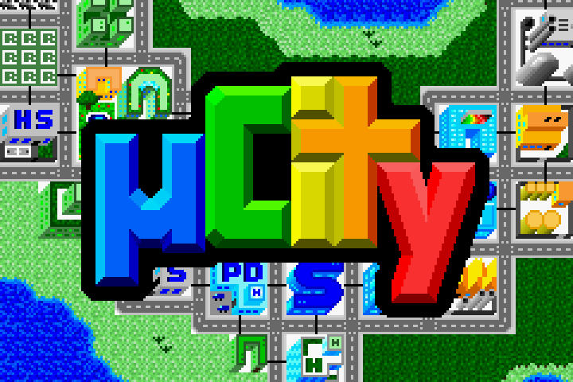
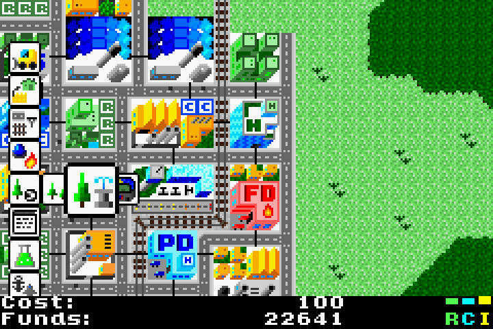
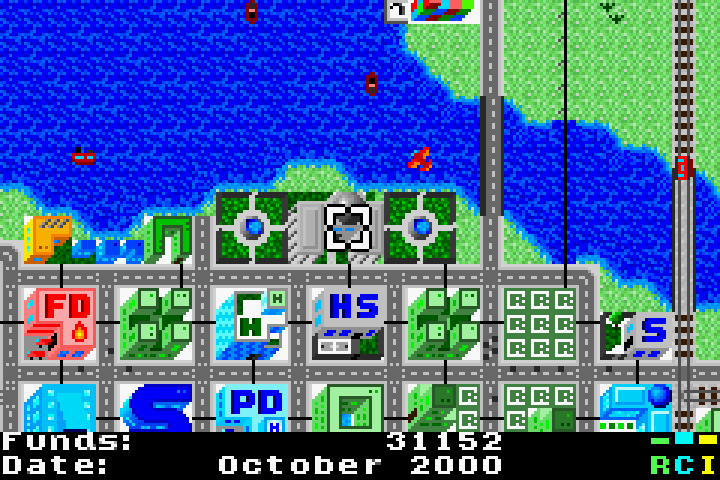
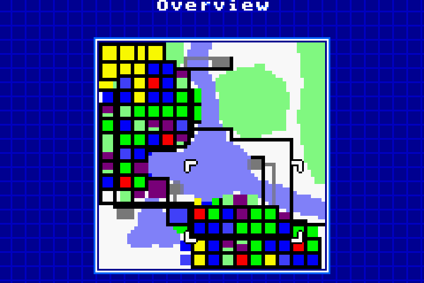
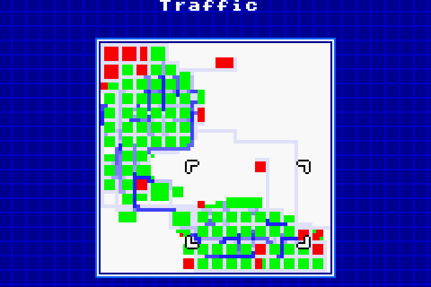

===================
µCity Advance 1.0.2
===================

Introduction
============

This is µCity Advance (also spelled 'uCity', pronounced 'micro-city'), the
open-source city-building game for Game Boy Advance. This is a remake of the
original `µCity for Game Boy Color <https://github.com/AntonioND/ucity/>`_.

This game is completely free. Just download the ROM, install a Game Boy Advance
emulator, and play! The last release of the game should be here:

https://github.com/AntonioND/ucity-advance/releases

You can also play on real hardware. Even though the game has been developed
using mainly emulators, it has been verified to work on hardware.

This video shows the game in action: https://www.youtube.com/watch?v=xYQfRM_zih0

Manual
======

There is a short manual with instructions for the player `here <manual.rst>`_.

Compiling
=========

For instructions on how to compile the game, check `this <compiling.rst>`_.

Note that, because of using **UGBA**, it is possible to build this game natively
for PC as well.

Credits
=======

Game, art, SFXs and some music made by AntonioND/SkyLyrac (Antonio Niño Díaz).

- Email: antonio_nd (at) outlook (dot) com
- GitHub: https://github.com/AntonioND
- Website: www.skylyrac.net

Most music obtained from https://modarchive.org/.

Third party tools and libraries used:

- devkitPro: https://devkitpro.org/
- SDL 2: https://www.libsdl.org/
- libpng: http://www.libpng.org/pub/png/libpng.html
- GiiBiiAdvance: https://github.com/AntonioND/giibiiadvance
- Aseprite: https://www.aseprite.org/
- Tiled: https://www.mapeditor.org/
- JFXR: https://jfxr.frozenfractal.com/
- Open ModPlug Tracker: https://openmpt.org/
- The Mod Archive: https://modarchive.org/

Licenses
========

Different parts of the game have different licenses.

- Code: GPL-3.0-only

- Art: CC-BY-NC-SA-4.0

- Music: Most songs have been obtained from https://modarchive.org/ and they are
  from different authors. Their license is the Mod Archive Distribution License.
  Each mod file is acompanied by a txt file that makes this explicit, as well as
  having a link at the original location. Songs without a txt file and all
  sound effects are original. They are licensed under the CC-BY-NC-SA-4.0.

The full text of all licenses can be found in the **licenses** folder.
